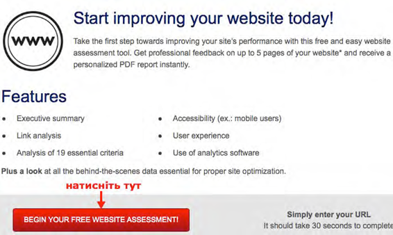
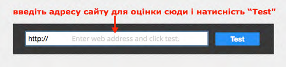
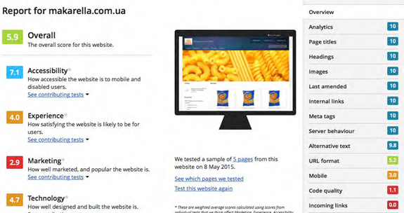
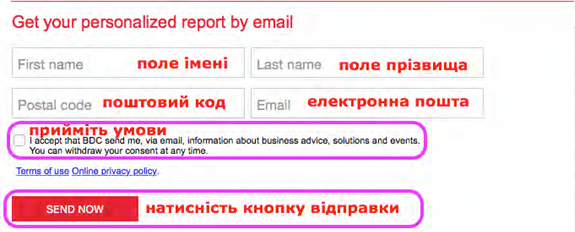

<h1 id="електронні-інструменти-експорту-та-електронні-комунікації-малого-бізнесу9">Електронні інструменти експорту та електронні комунікації малого бізнесу<a href="#fn_9" id="reffn_9">9</a></h1>

В українській практиці непоодинокими є випадки, коли якісний корпоративний сайт і присутність на В2В-платформах дозволяють компанії отримувати, як мінімум, випадкові замовлення без потреби в додаткових витратах на рекламу та просування товару.

Надзвичайно важливо визначитися, *як ви будете позиціонувати себе на вашому сайті для експорту*. Припустимо, що вітчизняний виробник одягу має власну марку в Україні, під якою він продає свою продукцію на національному ринку. Водночас, він шукає входження в західні роздрібні мережі під їхньою власною торговою маркою. У цьому випадку акценти в поданні інформації для іншомовного експортного сайту природно будуть відмінними. Тому *експортний сайт має бути не просто механічним перекладом україномовної версії, але переосмисленням інформаційних потреб вашої закордонної цільової аудиторії*. 

На сайті надавайте вичерпну *інформацію про вашу компанію, про контакти для зв'язку*, створіть помітну кнопку для початку "живого чату" (*live chat*) або легкодоступну форму для надсилання повідомлень. 

Проблемою багатьох сайтів є те, що вони не стимулюють взаємодії з відвідувачами, а натомість надають статичну інформацію. У *сьогоднішніх умовах потрібно прагнути, щоб ваш корпоративний експортний сайт ставав інструментом двосторонньої комунікації*. Для цього ви маєте стимулювати онлайн-взаємодію цільових груп відвідувачів з вами та з іншими відвідувачами: обмін думками, побажаннями та досвідом. У цьому може допомогти додавання до сайту онлайн форуму, кнопка вподобання *Facebook*, стрічка *Twitter* інтегрована на вашому сайті або в якості окремого інформаційного джерела. Такі кроки та прийоми призначені для побудови тривалого зв'язку та вироблення лояльності споживачів, піднесення корпоративного іміджу. Ідея полягає в тому, щоб «спокушати» відвідувачів вашого електронного ресурсу ділитися інформацією, виявляти свої бажання та важливі споживчі характеристики.

Ваше *ставлення до споживачів та піклування про них має бути помітним на вашому сайті*. Це стосується сектору сайту стосовно зворотнього зв'язку, подяки за відвідування, прохання заповнити опитувальник, що допоможе краще їх обслуговувати. Опитувальник має допомогти визначити особливих або бажаних споживачів, які можуть потребувати нестандартних товарів чи послуг. 

Корпоративні принципи компанії Amazon

Інтернет-гігант Amazon декларує на своєму порталі 14 власних принципів корпоративного лідерства, що спрямовують діяльність усього їхнього персоналу. Принципом номер один є "одержимість клієнтами": лідери починають від клієнта і відштовхуються від нього. Вони енергійно працюють, щоб завоювати і утримувати клієнтську довіру. Хоча лідери зважають на конкурентів, їхня одержимість клієнтами є переважаючою.<a href="#fn_10" id="reffn_10">10</a>

Дозвольте відвідувачам зв'язуватися з вами різними методами: через фізичну адресу для надсилання електронного листа *реальній людині*, електронну пошту, телефон, *Skype*, заповнення форми для запиту яка містить багато підказок тощо. Забезпечте, щоб усі листи та звернення отримували належну відповідь від представників компанії. Це є зона, визначена, як ключовий "стартер" спілкування з відвідувачами. Посил, який ви передаєте їм: ми дбаємо про вас і ви є для нас важливими

*Відвідувач вашого сайту не повинен відчувати тиску* – необхідно зробити усе, аби він почувався таким, що контролює процес взаємодії з сайтом. Скористайтеся сервісом *виникаючого віконця (чату) для відвідувачів*, що провели на вашому сайті певну кількість часу, але нічого не купили і не здійснили жодних активних дій. Ваші пропозиції мають бути зрозумілими і не містити прихованих "накруток" – таким чином, щоб їх можна було легко порівнювати з пропозиціями конкурентів. Поміркуйте щодо можливості використання інструменту коротких опитувань відвідувачів сайту, що дозволило б вам краще обслуговувати їх. Метою використання подібних інструментів є ідентифікація споживачів з особливими потребами. 

*Приваблюйте споживачів*, що не лише лояльні у ставленнях і діях, але які також *приносять прибуток*. Цього можна досягти ставлячи питання та уважно слухаючи відповіді. Кінцевий результат буде апелювати до споживачів, бо вони були залучені до процесу.

У разі, якщо хостингова компанія пропонує серед своїх послуг *оптимізацію сайтів за ключовими словами* до найпоширеніших пошукових систем, скористайтеся такими можливостями. 

Для сучасного споживача *швидкість доступу до інформації* також має значення. Він шукає швидких, простих рішень своїх проблем. Подивіться на свій електронний ресурс очима споживача. Коли ви відвідуєте веб-сайт, ви вражені? Мотивовані до дій? Мотивовані відвідати цей сайт знову? Якщо ні, поверніться до проектування сайту і покращуйте його доти, доки він не стане привабливим і корисним

Самовиражайтеся, але не викладайте "історію свого життя" на веб-сайті. Ваші посили мають бути точними, але достатньо цікавими, щоб відвідувачі залишалися з вами і зрештою вчиняли дії (купували ваш продукт). **Контент сайту має бути пов'язаний з тими діями, які ви хотіли б щоб відвідувачі здійснили.**

Стежте, щоб *зміст вашого сайту залишався актуальним і свіжим, цікавим і зосередженим на професійній тематиці*, а гіперпосилання були робочими. Надавайте інформацію у зрозумілому вигляді і не перевантажуйте інтерфейс графічно. Швидкість підключення до Інтернету цільової групи споживачів може також бути фактором у рішенні про розміщення більшої або меншої кількості відео, графіки тощо. Прагніть до того, щоб ваш сайт мав *приємний та функціональний дизайн*. Це включає і добре продумане розташування елементів на сторінках. 

За потреби, розгляньте можливість найму *професійного дизайнера веб-сайтів*. Така людина має додатково розумітися на питаннях *значення кольорів та символів для різних культурних національних груп*.

*Якщо ви маєте дистриб'ютора свого товару в певній країні, ця інформація повинна надаватися на вашому сайті –* інформаційний блок про дистриб'ютора з його контактами та/або посиланням на його веб-сайт. У свою чергу, простежте, щоб компанія-дистриб'ютор у цільовій країні також розмістила інформацію про вас!

Увесь *сайт має бути добре структурований* – кожна веб-сторінка виконує свою окрему функцію і доносить до відвідувача окрему інформацію. Орієнтування на сайті має бути легким та інтуїтивним. На першому плані в донесенні інформації до відвідувачів мають стояти інформаційні потреби вашої цільової аудиторії. Якщо ви зможете додавати подібний контент до сайту, то це значно підвищить відвідуваність і, можливо, додасть до вашої репутації як лідера думок на ринку свого продукту чи рішення.

*Подбайте про мобільну версію сайту*, оскільки світовою тенденцією є зростаюча кількість відвідувань з мобільних пристроїв. У разі великої відвідуваності мобільної версії можна поміркувати про розробку мобільного додатку для популярних платформ смартфонів.

*Попросіть протестувати ваш сайт когось зі своїх знайомих* у цільовій країні і висловити свої думки – зокрема з огляду на існуючі там особливості сприйняття інформації. Протестуйте роботу сайту з різними браузерами, на мобільній платформі (за наявності). Подібне стосується і тестування сайту для закордонних Інтернет-продажів. Здійснення реальної покупки з-за кордону представником цільової аудиторії може підказати вам важливі технічні та дизайнерські рішення, що необхідні для успіху в електронних продажах. Робота з сайтом і купівля товару має бути приємним досвідом, що включає в себе також і зручну оплату за товар.<a href="#fn_11" id="reffn_11">11</a>

Подивіться *наскільки сайт оптимізовано для Інтернет-пошуковиків* – оптимізація має бути зроблена в рамках кожного окремого мовного семгенту.

Корисні посилання

Агенція розвитку бізнесу Канади пропонує безкоштовний сервіс оцінки вебсайтів. Сервіс дозволяє оцінити корпоративний сайт за великою кількістю критеріїв: доступність, узгодженість та якість посилань, поведінка сервера, ступінь соціального інтересу до сайту, помилки в коді сторінок та багато іншого). Щоб скористатися сервісом, необхідно вставити у відображене на сторінці поле адресу свого веб-сайту. Після цього сервіс проведе діагностику вашого сайту і видасть результати оцінки разом із рекомендаціями щодо вдосконалення сайту. Для використання інструменту оцінки веб-сайтів перейдіть за посиланням <a href="www.BDC.ca/testyourwebsite">www.BDC.ca/testyourwebsite</a> і натисність кнопку "Begin your free website assessment!" (почніть свою безкоштовну перевірку веб-сайту). 

У віконце, яке з'явиться, необхідно ввести веб-адресу сайту, що буде оцінюватися. 

Система видасть вам приблизно таку картинку 

Перейшовши нижче за сторінкою, ви можете залишити свою інформацію для того, щоб отримати повний файл звіту про тестування сайту на вашу електронну скриню. 

Сформований сервісом звіт буде надіслано вам електронною поштою. 

<blockquote id="fn_9">
9. Текст на основі <a href="bit.ly/Web_site_rules">bit.ly/Web_site_rules</a> <a href="#reffn_9" title="Jump back to footnote [9] in the text."> ↩</a>
</blockquote>
<blockquote id="fn_10">
10. Джерело за посиланням <a href="bit.ly/Amazon_principles">bit.ly/Amazon_principles</a> <a href="#reffn_10" title="Jump back to footnote [10] in the text."> ↩</a>
</blockquote>
<blockquote id="fn_11">
11. Для більш глибокого ознайомлення з культурними нюансами сайтів варто ознайомитися з книгою <i>Nitish Singh and Arun Pereira, The Cultrurally Customised Web Site: Customizing Web Sites for the Global Marketplace (Oxford, UK: Elsevier 2011)</i> <a href="#reffn_11" title="Jump back to footnote [11] in the text."> ↩</a>
</blockquote>