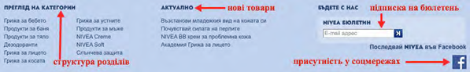
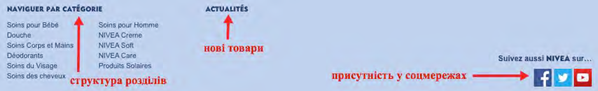
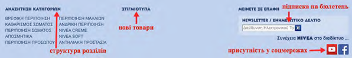

# Локалізація та інтернаціоналізація вмісту веб-сайту

Компанії, що прагнуть контакту з іноземною аудиторією через свої веб-сайти, можуть іти шляхом локалізації або інтернаціоналізації сайту. Вони також можуть використовувати обидва з цих підходів. Локалізація полягає в адаптації веб-сайту до лінгвістичних, культурних та комерційних вимог цільового ринку. Якщо у вас бракує ресурсів для перекладу сайту на іншу мову, можна скористатись Google-сервісом для перекладу – дивіться розділ Як перекласти зміст вашого Інтернет-сайту на інші мови?. Водночас, *за першої нагоди, треба прагнути до забезпечення професійного людського перекладу*, оскільки некоректний переклад може відторгнути або образити цільову аудиторію. Другий підхід – інтернаціоналізація веб-сайту – надає можливість компанії бути багатомовною та чутливою до культурних звичаїв без потреби масштабної зміни дизайну. Інтернаціоналізація веб-сайту закладає єдиний "каркас" та архітектуру для всіх локальних версій сайтів. Локалізація та інтернаціоналізація є елементами корпоративної стратегії для веб-сайту та розвитку бізнесу онлайн-експортера. 

У переважній більшості випадків компанія застосовуватиме сполучення цих обох підходів. Розглянемо приклад компанії *Nivea*. 

Сайт компанії <i>Nivea</i>

Головна міжнародна сторінка <a href="https://www.nivea.com">www.nivea.com</a> містить розбивку країн присутності за континентами – звідти можна обрати необхідну національну версію. У свою чергу, локальні сайти таких країн, як Болгарія, Греція та Франція містять відмінні структури розділів. Відмінними є і присутність/відсутність у соціальних мережах та наявність або відсутність підписки на електронний бюлетень для кожної країни. Подібним чином на самих сторінках відрізняються рекламні картинки.<a href="#fn_13" id="reffn_13">13</a>

Фрагмент веб-сторінки корпоративного сайту <i>Nivea</i> для Болгарії 

Фрагмент веб-сторінки корпоративного сайту <i>Nivea</i> для Греції 

Фрагмент веб-сторінки корпоративного сайту <i>Nivea</i> для Франції 

З-поміж рис, які ваша компанія має розглянути в ході розробки моделі бізнесу онлайн, такі:
<li>мова;</li>
<li>культурні особливості цільової Інтернет-аудиторії, такі, як відмінності в кольорових асоціаціях та символах;</li>
<li>преференції щодо оплати за купівлю вашої продукції;</li>
<li>ціноутворення та зручна валюта платежу;</li>
<li>конвертер валют.</li>

Мова сайту

Хоча англійська використовується в багатьох країнах, усе ж важливо прагнути до використання мови, що  домінує в цільових країнах. Згідно з вашою стратегією електронної торгівлі. ваш веб-сайт має розроблятися для охоплення якнайширшої аудиторії її рідною мовою. 
У міру розвитку вашого експорту веб-сайт, цільовою аудиторією якого є європейські споживачі, потребуватиме поступового запровадження кількох мовних версій, серед яких англійська, французька, італійська, німецька та іспанська.<a href="#fn_14" id="reffn_14">14</a>

*Починайте роботу зі своїм експортним сайтом з однієї експортоорієнтованої версії і мови* і згодом розширюйте "покриття" на основі інтересу та попиту на ваші продукти. Регулярно аналізуйте географію відвідувань вашого сайту. Якщо на нього заходить багато відвідувачів з країни, мовою якої сайт ще не доступний, можливо варто подумати про додавання такої версії або створення додаткового сайту мовою такої країни. Якщо для кожного цільового ринку робиться окремий сайт, то у його розширенні або імені може фігурувати назва країни, для якої він призначений. 

Окрім того, аналізуйте звідки відвідувачі переходять на ваш сайт і на його окремі сторінки. Наприклад, ви можете дізнатися чи вони перейшли на сайт  - через пошуковики, рекламні оголошення, електронні листи, блоги або пов'язані електронні ресурси. Аналізуйте, як відвідувачі переходять на окремі сторінки вашого сайту, яким є шлях відвідувача від однієї сторінки до іншої.

Визначте технічне завдання для розробки загальної архітектури та "національних версій" сайту і осіб, що відповідатимуть за переклад та загальне адміністрування вашого експортного онлайн-ресурсу. Для реалізації проекту розробки та запуску експортної версії розгляньте різні варіанти залучення персоналу компанії та зовнішніх спеціалістів. 

Зазвичай кожна компанія знаходить своє власне рішення відносно того, *за яким алгоритмом визначати назви сайтів для окремих країн*. Створення кожного окремого сайту для нового ринку має бути невід'ємною частиною вашої експортної стратегії. 

Веб-адреса має бути короткою, простою, описовою і такою, що запам'ятовується споживачам цільових ринків. Онлайн експортер може обрати доменне ім'я, локалізоване для цільових ринків. Місцеві доменні імена можуть збільшити впізнаваність бренду й рівень запам'ятовування веб-адреси. Вони можуть навіть вплинути на продажі та лояльність до бренду. Окрім того, більшість місцевих пошукових систем показують лише місцевий контент шляхом фільтрації пошукових результатів, щоб включити лише місцеві домени з кодом країни. Якщо ваша компанія бажає мати місцеве доменне ім'я, ви маєте ознайомитися з вимогами реєстрації для окремої країни, оскільки вони можуть різнитися.

Якщо ваша компанія шукає іноземних споживачів, ви можете також обрати міжнародне або багатомовне доменне ім'я. Такі доменні імена є веб-адресами, що пишуться буквами, відмінними від римської абетки. Наприклад, компанія, що називається «Яскраві лампочки» і бажає продавати в Китаї, може мати доменне ім'я, що використовуватиме китайську абетку для «Яскраві лампочки» у своїй веб-адресі. Міжнародні або багатомовні доменні імена дозволяють споживачам шукати сайти своєю рідною мовою.

У ході розробки сайту необхідно ухвалити принципове рішення про його архітектуру, про те, які домени будуть використовуватися для кожної цільової країни, наприклад:<a href="#fn_15" id="reffn_15">15</a>
<ul type="disc">
<li>контент іншою мовою викладається у відмінний субдомен. Наприклад, <a href="https://en.example.com">en.example.com</a> – для англійської мови, <a href="https://de.example.com">de.example.com</a> – для німецької та <a href="https://es.example.com">es.example.com</a> – для іспанської</li>
<li>контент іншою мовою викладається у відмінну субдиректорію. Це легше робити під час оновлення та обслуговування вашого сайту. Наприклад, <a href="https://example.com/en/">example.com/en/</a> - для англійської, <a href="https://example.com/de/">example.com/de/</a> - для німецької і <a href="https://example.com/es/">example.com/es/</a> - для іспанської</li>
<ul type="circle">
<li>цей підхід варто використовувати в разі популярності назви компанії (сайту) на цільових ринках.</li>
</ul>
<li>контент іншою мовою викладається до домену верхнього рівня. Наприклад, <a href="https://example.en">example.en</a> – для англійської, <a href="https://example.de">example.de</a> – для німецької, <a href="https://example.es">example.es</a> – для іспанської.</li>
</ul>

Окрім того, можна розглянути "упереджувальну купівлю" сайтів у національних сегментах з метою ускладнити пізнішу реєстрацію сайтів, що будуть містити в собі назви вашої компанії/продукту конкурентами.

Від самого початку розробки структури веб-сайту закладайте можливості його поступової міжнародної експансії в нові національні сегменти – у технічному, технологічному і маркетинговому відношенні. Необхідно також вирішити/з'ясувати, чи ви потребуватимете підтримки на місцях у країні, яку будуть обслуговувати ваші споживачі. Це залежатиме, в т.ч., від типу торгового посередника, якого ви використовуватиме на окремому експортному ринку та функцій, які будуть на нього покладені в рамках вашої угоди про співпрацю.

Після закладання основ необхідно визначитися з тим, як аналізуватиметься результативність функціонування сайту включно з відвідуваністю тощо.

<blockquote id="fn_13">
13. Фотофрагменти корпоративних сайтів Nivea для Болгарії (<a href="https://www.nivea.bg">www.nivea.bg</a>), Греції (<a href="https://www.nivea.gr">www.nivea.gr</a>) та Франції (<a href="https://www.nivea.fr">www.nivea.fr</a>) на 17 травня 2015 року. <a href="#reffn_13" title="Jump back to footnote [13] in the text."> ↩</a>
</blockquote>
<blockquote id="fn_14">
14. Текст на основі <i>10 Top Languages for your Business.</i> (2015, April 19). збережено 17 травня, 2015 р., за посиланням <a href="https://bit.ly/Top_business_languages">bit.ly/Top_business_languages</a> <a href="#reffn_14" title="Jump back to footnote [14] in the text."> ↩</a>
</blockquote>
<blockquote id="fn_15">
15. Джерело: <i>How to Start a Multilingual Site</i>, Google Webmaster Central Blog, остання модифікація 7 серпня, 2008 р., <a href="https://bit.ly/Start_multilingual_site">bit.ly/Start_multilingual_site</a> <a href="#reffn_15" title="Jump back to footnote [15] in the text."> ↩</a>
</blockquote>