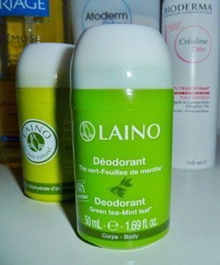

# Підхід до маркетингу товарів в Європі

Маркетинг товарів у Європі може бути побудований на двох рівнях: пан'європейському або адаптованому до країни. Культурні та мовні бар'єри ускладнюють досягнення успіху в пан'європейських програмах. Щоб забезпечити правильне розуміння інформаційних повідомлень, експерти рекомендують створювати упаковку, етикетки та рекламні матеріали окремо для кожної країни.<a href="#fn_27" id="reffn_27">27</a>

Перед початком діяльності на іноземному ринку ви можете  дослідити конотацію (асоціативний зв'язок) між торговою маркою, торговим іменем, числом тощо, чи не перекладається/звучить назва вашого товару мовою цільового ринку в якийсь небажаний спосіб? 

Інша мова або культура можуть мати негативне або навіть беззмістовне чи брутальне значення для слів або символів із нейтральними або позитивними асоціаціями в іноземній країні. 

Фото: дезодорант марки <i>Laino</i><a href="#fn_28" id="reffn_28">28</a>

Складність вимови вашої торгової марки також може бути проблемою, яку треба протестувати на цільовій аудиторії. Окрім того, деякі числа вважаються позитивними або негативними, і це теж треба брати до уваги під час визначення ваги товару (яка зазначатиметься на упаковці) або кількості одиниць в пачці. Наприклад, на Заході число сім вважається щасливим, тоді як тринадцять – нещасливим.

Навіть колір упаковки може бути пов'язаний з іншим значенням, залежно від країни. Наприклад, білий означає чистоту в США, але є кольором скорботи в більшості країн Далекого Сходу. 

У випадку багатонаціональних компаній, що просували свої товари на європейські ринки, мали місце прикрі випадки некоректного перекладу. Так, частина назви торгової марки Чеві Нова (*Chevy Nova*) іспанською звучить, як «не йде» (*no va*), а слоган Пепсі *«Come Alive With Pepsi»* (оживи з Пепсі) перекладається на німецьку, як «повстань із труни з Пепсі».<a href="#fn_29" id="reffn_29">29</a>

Успішні продажі в Європі можуть потребувати від українських виробників зміни самого підходу до виробництва та продажу. Європейські споживачі очікують на придбання не просто товарів, а рішень. Успішна розробка та маркетинг товару в розвинених країнах вимагають емпатії  щодо споживачів, здатності думати так, як споживачі та розробляти та продавати такі товари, що відповідають їхнім потребам, радше, ніж слідувати у фарватері товарів конкурентів.

Якість - це те, що клієнт сприймає як якість. Для окремих груп клієнтів те, що є якістю для інших, не буде якістю для них. І тому емпатія є двічі важливою! Наприклад, німецькомовні споживачі погано сприймають органічні продукти, які негарно (природно) виглядають. Разом із тим, в інших країнах крива морква або яблука зі щербинками в категорії органічної продукції можуть сприйматися цілком нормально.

<blockquote id="fn_27">
27. Адаптований текст на базі <a href="https://bit.ly/business_culture">bit.ly/business_culture</a> <a href="#reffn_27" title="Jump back to footnote [27] in the text."> ↩</a>
</blockquote>
<blockquote id="fn_28">
28. Джерело за посиланням <a href="https://bit.ly/LainoPhoto">bit.ly/LainoPhoto</a> <a href="#reffn_28" title="Jump back to footnote [28] in the text."> ↩</a>
</blockquote>
<blockquote id="fn_29">
29. Там само. <a href="#reffn_29" title="Jump back to footnote [29] in the text."> ↩</a>
</blockquote>