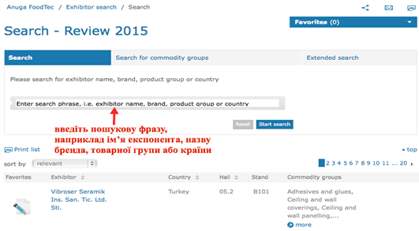
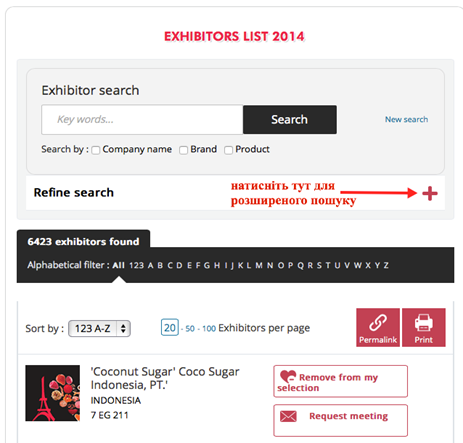

# Традиційні галузеві виставки

Практично кожна галузь має свої традиційні виставки, що проводяться з певною регулярністю (щорічно або кожні 2-3 роки). Необхідно визначити «свої» виставки і, за першої нагоди, почати відвідування – спочатку як звичайний відвідувач, а згодом – як повноцінний учасник зі стендом. Для багатьох європейських компаній відвідування «своєї» виставки є частиною бізнес-моделі і бізнес-циклу.

<b>Головні європейські виставки в харчовій галузі</b>

<b>Anuga FoodTec</b> (<a href="anugafoodtec.com">anugafoodtec.com</a>) - виставка проводиться кожні три роки в Кельні (Німеччина) і позиціонує себе як "місце зустрічі харчової галузі та її постачальників". Anuga FoodTec покриває всі аспекти виробництва продовольства. У 2015 році виставка  зібрала понад 435 000 відвідувачів зі 139 країн і тривала 4 дні. Серед учасників представлені сектори й рішення в галузі нових технологій обробки продуктів харчування, пакування їжі, харчової безпеки, харчових інгредієнтів та послуг. Наступна виставка Anuga FoodTec запланована на березень 2018 року. 
У міжвиставковий період можна скористатися безкоштовним сервісом виставки – базою даних експонентів 2015 року за посиланням <a href="bit.ly/AnugaFoodTec_Exhibitor_search">bit.ly/AnugaFoodTec_Exhibitor_search</a>. Це може допомогти, в т.ч., і у пошуках партнерів.

Іншою постійнодіючою послугою виставки є безкоштовне знаходження необхідних бізнес-контактів (matchmaking). Замовлення пошуку бізнес-контактів можна робити за експонентами <a href="bit.ly/ExSearch">bit.ly/ExSearch</a> або за відвідувачами <a href="bit.ly/VisitSearch">bit.ly/VisitSearch</a>. 
Знаходження бізнес-партнерів через попереднє ознайомлення онлайн і послідуючі фізичні зустрічі є ще одним видом діяльності Anuga. Подібні заходи проводяться практично щорічно. Наприклад 13-14 жовтня 2015 р. За усіма подібними подіями можна слідкувати на європейському ресурсі заходів по знаходженню партнерів. 
<b>SIAL</b><a href="#fn_37" id="reffn_37">37</a>  (<a href="sialparis.com">sialparis.com</a>) – виставка проводиться кожні два роки в Парижі та спеціалізується на харчовій промисловості. У 2014 році виставку відвідали 155 тисяч осіб зі 194 країн. До 40% відвідувачів походять з Європейського Союзу. Учасники виставки у 2014 році розподілялися таким чином: 51% роздрібні мережі/торгівля, 23% - агропродовольчий сектор, 16% - харчові послуги, 10% - послуги та професійні органи. Наступна виставка SIAL запланована на жовтень 2016 року. 
Подібно до <i>Anuga FoodTec</i>, на сайті виставки можна вести пошук серед компаній-експонентів у режимі простого та розширеного пошуку <a href="bit.ly/SIALsearch">bit.ly/SIALsearch</a>. Сайт також надає можливість надсилати експонентам електронні листи-запити щодо зустрічі.  

<blockquote id="fn_37">
37.  фр. <i>Salon International de l'alimentation</i> – міжнародна виставка харчуваня <a href="#reffn_37" title="Jump back to footnote [37] in the text."> ↩</a>
</blockquote>