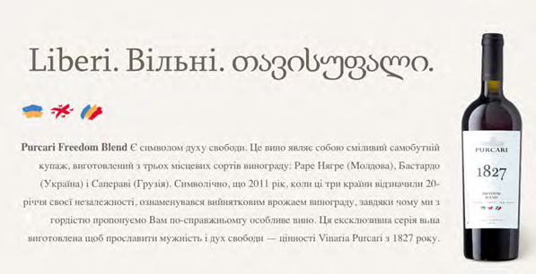
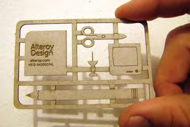
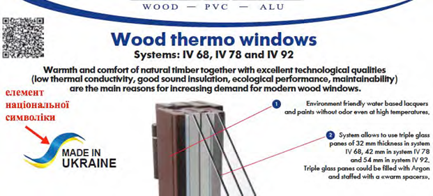

# Творчий підхід до маркетингу і створення нових смислів

Не продавайте товари, послуги або роботи. Продавайте мрії і видіння.

<i>Стів Джобс</i>

Особливе позиціонування товару і його успіх серед споживачів може бути результатом не лише унікальних якісних характеристик продукту, але і його дизайну або особливих історій – ідей-смислів, що вкладаються в продукт. Яскравим прикладом створення такого смислу є розробка «легенди» молдовською компанією *PURCARI* для продажу вина «Вільні».

<i>Веб-сторінка компанії <i>Purcari</i>, присвячена вину «Вільні»<a href="#fn_21" id="reffn_21">21</a> </i>

Подібно до розробки красивої і правдоподібної легенди до свого продукту, виробники можуть, разом із захопливою історією передати іншу інформації, що підвищить репутацію або довіру до товару/бренду – наприклад, «багаторічний досвід» у виготовленні певного товару, «унікальні риси» сировини або виробничого процесу тощо. Окрім того, у контексті подібних легенд можна здійснювати територіальний маркетинг і просувати національні та регіональні бренди – "Україна", "Чернігівщина", "Харків" тощо. Слідкуйте лише за тим, щоб усе це було щиро й природно. Тоді смисли, сформовані навколо ваших продуктів, будуть надихати як споживачів, так і вашу власну команду.

За час від початку гібридної агресії з боку Російської Федерації у 2013 році український народ показав безліч прикладів мужності, героїзму та самопожертви в боротьбі за українську державу та незалежність. Цей великий шар смислів ще практично не був використаний українським бізнесом – зокрема, для цілей експорту. Між тим, використання подібних образів може сприяти не лише успіху окремого продукту, але й формуванню позитивного міжнародного бренду України, українського народу, як спільноти, що здатна відстоювати власну гідність та незалежність навіть у складних умовах війни з кількісно переважаючим супротивником.  
Пересторогою в цьому випадку є почуття міри та балансу, щира повага до тієї історії, що вводитиметься в легенду або назву вашого продукту – тільки в цьому випадку споживачі почнуть відчувати те ж саме, що і ви. Для цих цілей варто радитись зі спеціалістом, що добре розуміється на темі, пов'язаній з вашою легендою. За умови грамотного підходу, між вами і вашими споживачами розвиватимуться спільні цінності та виникатимуть спільні емоції. Такі переживання є потужним чинником цементування споживачої лояльності.

Створення смислів для товарів може базуватися також і на культурно-історичному підході, коли легенда продукту занурюється корінням в історію.

Оригінальна візитівка допоможе вам запам'ятатися серед великої кількості контактів. Це є особливо важливим під час знайомства на масових заходах, наприклад міжнародних торгових виставках - там, де кожна людина за день отримує по кілька сотень візитівок.

Джерело за посиланням  <a href="http://bit.ly/Business_card_design">bit.ly/Business_card_design</a> 

Окрім безпосереднього символізму, пов'язаного з конкретним бізнесом і продуктом, на картках і рекламних матеріалах можуть також використовуватися  елементи національної української символіки або кольорів. Так, спільно, просуваються корпоративний та національний бренди.

Джерело слайду: рекламні матеріали компанії Kwinswig <a href="http://kwinswig.com.ua">kwinswig.com.ua</a> 

Символізм може вкладатися в будь які елементи та інформаційні матеріали. Наприклад, цікавим є вітальне повідомлення на сайті харківської компанії BORIKA<a href="#fn_23" id="reffn_23">23</a>

<table>
  <tr>
    <td width="50%" align="center"><b>Англійською</b></td>
    <td width="50%" align="center"><b>Переклад українською</b></td>
  </tr>
<tbody>
  <tr>
    <td width="10%" style="vertical-align:top !important;">
WELCOME TO COOPERATION! 
We are proud to offer products of Ukrainian origin to foreign partners, thereby making a significant contribution to the national economy of our country and - we are sure - in the world history of the production of equipment and accessories for boats...
    </td>
    <td width="10%" style="vertical-align:top !important;">
Щиро запрошуємо до співпраці! 
Ми з гордістю представляємо товари українського походження закордонним партнерам, тим самим роблячи значний внесок у національну економіку нашої країни і – ми впевнені у цьому – у світову історію виробництва устаткування та аксесуарів для човні...
    </td>
</tbody>
</table>

<blockquote id="fn_21">
21. Джерело за посиланням <a href="http://bit.ly/Purcari_Freedom_Blend">bit.ly/Purcari_Freedom_Blend</a> <a href="#reffn_21" title="Jump back to footnote [21] in the text."> ↩</a>
</blockquote>
<blockquote id="fn_22">
22. Текст люб'язно надано Миколою Скибою, директором ГО «Агенція культурних стратегій», <a href="http://www.facebook.com/myskyba">www.facebook.com/myskyba</a> <a href="#reffn_22" title="Jump back to footnote [22] in the text."> ↩</a>
</blockquote>
<blockquote id="fn_23">
23. Джерело за посиланням <a href="http://bit.ly/BORIKA">bit.ly/BORIKA</a> <a href="#reffn_23" title="Jump back to footnote [23] in the text."> ↩</a>
</blockquote>