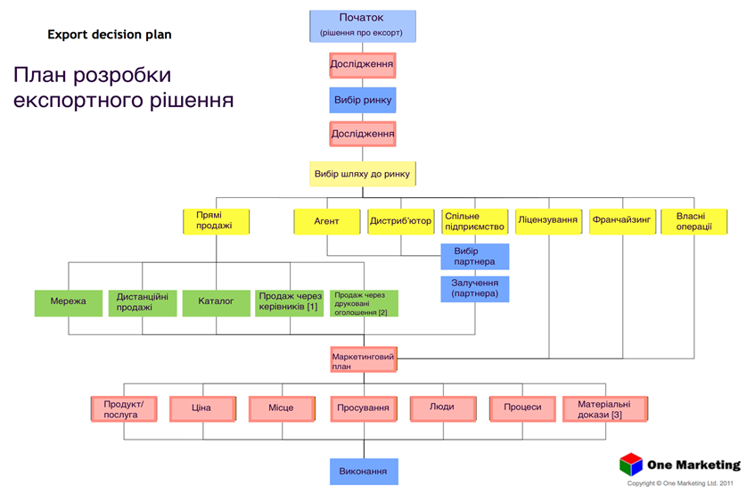

# План розробки експортного рішення

 

Дозвіл на використання діаграми люб'язно надано компанією One Marketing Ltd.  <a href="www.one-marketing.eu/">www.one-marketing.eu/</a>

Примітки: 
[1] англ. "Summit sell" - прямий продаж із країни походження від керівника підприємства через керівника підприємства організації-покупця 
[2] англ. "Off page" - продаж від оголошень у публікаціях – пряма реакція. Може бути різновидом B2B або C2C. 
[3] англ. "Physical evidence" - частина маркетингової композиції (marketing mix), спосіб виділити себе й отримати конкурентну перевагу на ринку. Це може бути ваша упаковка, якість приміщення, унікальне устаткування тощо. 